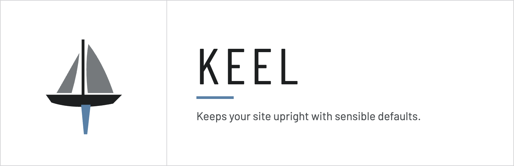
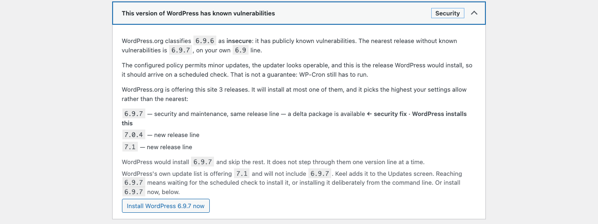
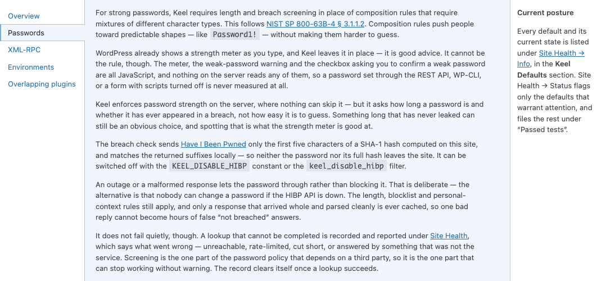
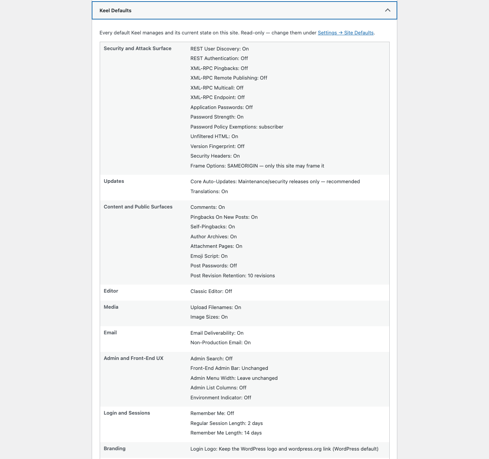

# Keel

  

 

**Sane, individually-toggleable defaults for every new WordPress site.**

Keel flips a menu of sensible security, update, privacy, content, media, email, UX,
and performance defaults onto any WordPress install — each one a switch under
**Settings → Keel**. Nothing is hidden and nothing is all-or-nothing: you can see
exactly what the plugin does to your site, in one place, and turn any piece off.

> **Status: released (`0.3.0`, 2026-08-10).** The feature set is frozen at 38
> defaults; the Site Health surface, multisite-aware seeding and network-wide
> policy are in. Not yet submitted to wordpress.org — what remains before that is
> verification, not features. See [ROADMAP.md](ROADMAP.md) for the milestones and
> [TODO.md](TODO.md) for what's in flight.

## What it looks like

**Settings → Keel.** Every default is one switch with the reason it exists written
beside it, so nothing the plugin does is hidden behind a name you have to guess at.

**The Passwords help tab.** Length and breach screening in place of composition
rules, with what the breach check actually sends spelled out — five characters of
a hash, never the password — and what it costs when the API is unreachable.

**Site Health → Info.** Every default and its current state on one read-only
screen, grouped by category and copyable as a block, so you can answer "what is
this plugin doing to my site?" without opening the settings and reading
checkboxes.

## What makes it different

Most "disable it" plugins close the front door and leave a side one open. Measured
against nine of the most-installed ones on wordpress.org — every result a live HTTP or
PHP probe against a real install, not a readme claim.

Comments were switched off in each plugin's own settings, then the database was asked
directly for approved comments with `get_comments()`:

- **Disable Comments** (1M+ installs) — the comment is still returned
- **Admin and Site Enhancements** (200k+) — still returned
- **Disable Comments RB** (100k+) — still returned
- **Simply Disable Comments** (6k+) — still returned
- **Keel** — nothing returned

The others stop at the theme template and the REST route. Keel is the only one in that
field that short-circuits `comments_pre_query`, so a Recent Comments widget from
another plugin, a custom `WP_Comment_Query`, or `wp_count_comments()` all see what the
setting says they should.

The same pattern runs through the rest: closing the REST API also means removing the
discovery link that advertises it, and disabling comments also means the comment feed
stops answering. The full comparison, and the cases where Keel makes a deliberate
trade instead, is in
[docs/competitive-teardown-matrix.md](docs/competitive-teardown-matrix.md).

Keel keeps oEmbed reachable when the REST gate is closed — alone among the four
plugins measured that close REST outright — so other sites can still embed your posts
instead of silently degrading them to bare links.

## Email stops at the edge of production

A database copied down from production brings real customer addresses *and*
whatever mail service production was using. A cron run, a bulk action or a
migration routine then emails real people from a staging site or a laptop. Keel
suppresses outgoing mail on any environment that is not production, on by
default, and says so in an admin notice rather than leaving somebody wondering
why a password reset never arrived.

"A local site cannot send mail anyway" is not a safeguard: measured on a stock
local install, the only thing stopping delivery was an invalid default `From`
address, which a copied production `siteurl` removes by definition — and an SMTP
plugin, which a production copy also carries, skips that question and connects to
the real provider.

It short-circuits `wp_mail()` with `true`, not `false`, so a staging site does not
start exercising failure paths that production never takes. Turn it off under
**Settings → Keel**, or per-site with `KEEL_ALLOW_NONPRODUCTION_MAIL` or the
`keel_suppress_nonproduction_mail` filter. `keel_outgoing_mail_suppressed` fires
in place of the send, so a mail catcher can still record the message.

The second email default is a warning, not a change: Keel flags a production site
whose `From` address looks undeliverable, and catches the bulk password reset that
reports success after sending zero emails.

## How it's built

One array — `keel_defaults_schema()` — is the single source of truth for structure.
It drives both the settings screen and the bootstrap that wires each *enabled*
default to its WordPress hook. Adding a default is usually one schema entry, one
`if`-block in bootstrap, and its display copy in `includes/strings.php` under the
same key; no new settings-page code. Several defaults share a bootstrap block where
they belong together — the XML-RPC family is one — so that is the shape rather than
a rule. A default is an opinionated filter behind a toggle.

Two things it does that a settings screen usually does not:

- **Site Health reports the posture**, read-only — every default and its current
  state, so the site's actual configuration is legible without clicking through
  tabs.
- **It notices when another plugin is setting the same defaults.** Two plugins can
  both set a session length; WordPress keeps whichever ran last and the loser's
  settings screen goes on displaying a value the site does not use, with no error
  anywhere. Keel reports the collision and names what is contesting what — it does
  not tell you which plugin to keep, because a plugin answering that is arguing for
  its own retention. Keel also stays off a hook entirely when its setting would only
  repeat what WordPress already does.

## Try it in the browser

A [WordPress Playground](https://playground.wordpress.net/) blueprint spins up a
throwaway site with Keel installed, so you can see all 38 defaults and their
states without a host or a local WordPress.

**[▶ Try the latest release](https://playground.wordpress.net/?blueprint-url=https://raw.githubusercontent.com/dknauss/keel/main/playground/blueprint-stable.json)** — byte-identical to what you would download, and it follows each new stable release.

**[▶ Try the rolling build](https://playground.wordpress.net/?blueprint-url=https://raw.githubusercontent.com/dknauss/keel/main/playground/blueprint-hosted.json)** — the `latest` pre-release, for previewing changes before they are cut.

Both open **Settings → Keel** and create a published post, so the content
defaults — comments, pingbacks, author archives, attachment redirects — have
something to act on. An empty site makes half the toggles look inert.

`latest` is republished by `release.yml` on every version tag, not on every push
to `main`, so the rolling demo can sit behind the branch. Check what it is
actually serving before reading anything into it —
[`playground/README.md`](playground/README.md) has the one-line `curl`.

## Install

Copy the plugin folder into `wp-content/plugins/` and activate, or install the built
zip. On activation the documented defaults are seeded; then visit **Settings → Keel**.

## Licence and credits

[GPL-2.0-or-later](LICENSE) — the same terms as WordPress itself. Keel is a de-branded
evolution of [Better by Default](https://github.com/WPYEG/Better-by-Default) (WPYEG),
whose sole author also licenses the portions carried over here under GPL-2.0-or-later,
with further defaults adapted from the Pixel Managed Platform plugin — itself a hard
fork of [10up Experience](https://github.com/10up/10up-experience) by 10up
(GPL-2.0-or-later), from which several of those defaults ultimately descend. 10up
retains its copyright and marks; Keel is not affiliated with or endorsed by 10up. Full
attribution is in the Credits section of `readme.txt`.
