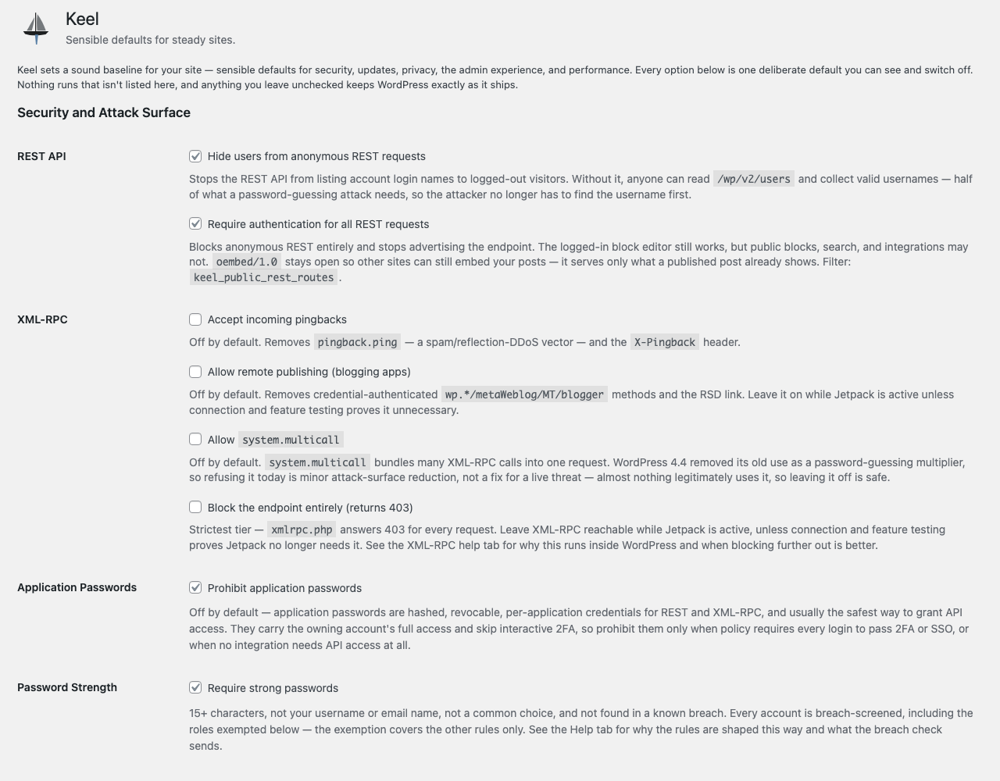

# Keel

  

 

**The missing settings and defaults every new WordPress site needs.**

Keel adds a modest menu of sensible security, update, privacy, content, media, email, UX, and performance defaults to WordPress — each one a switch under **Settings → Site Defaults**. Nothing is hidden. Everything is explained with helpful dropdown info panels and in Site Health feedback.

> **Current release: `0.6.0`.** Keel now has 39 defaults; the Site Health
> surface, multisite-aware seeding, network-wide policy
> and detection of other plugins controlling the same settings are in. New in
> 0.6.0: Keel reports whether the running WordPress version has publicly known
> vulnerabilities, names the patched release on its own line, shows what core would
> select, and lets an authorized administrator install the same-line patch through
> WordPress's upgrader with rollback enabled. Nothing installs without a click. CI covers
> PHP 7.4 through 8.5; live WordPress checks include 6.4 and 7.2-alpha on single-site
> and multisite, while the installer matrix runs from 6.4 through the current 7.1.
> See [ROADMAP.md](ROADMAP.md) for the
> milestones and [TODO.md](TODO.md) for what's in flight.

## Set and forget — What Keel establishes as a baseline

Activating Keel switches on sixteen of its thirty-nine defaults and applies a starting value to nine more, without writing to your content or deleting anything — every one is a switch on **Settings → Site Defaults**, and deactivating Keel puts WordPress back exactly as it was.

Most of the immediate changes are quiet: users stop being listed for anonymous REST requests, new passwords must be long and never present in a data breach known to Have I Been Pwned (HIBP), raw HTML is limited to Administrators, security headers go out, AI connectors are turned off, uploads get lowercase filenames, and the site starts warning you if its email sending capability looks broken.

Three things change visibly on the first page load — comments, trackbacks and pingbacks are off everywhere including existing posts (nothing deleted, all reversible), author archives stop resolving, and `X-Frame-Options: SAMEORIGIN` stops other sites embedding yours. 

Other quieter changes also kick in: attachment pages redirect to their parent post, self-pingbacks are disabled, and the emoji script is gone. 

The starting values are conservative: 
 - Core takes minor (including security) releases and translation updates but not major versions — so Keel keeps the same channel open that core enables by default, setting it explicitly and visibly rather than inheriting it.
 - A maximum of ten revisions are kept for version-controlled content.
 - Logins last two days or fourteen if "Remember me" is selected on login (the normal core defaults).
 - Subscribers are exempt from the password rules.
 - The admin menu, front-end admin bar and login logo are left exactly as WordPress has them by default.

One default is on but inert on a live site: outgoing email is blocked on any environment that isn't production, so a database copied to staging can't email real users who slip through. (You should always scrub sensitive user data when moving it out of production.)

**Security and attack surface**

- REST User Discovery — hides users from anonymous REST requests
- Password Strength — requires strong passwords (length + breach screening; subscribers exempt by default)
- Unfiltered HTML — limits raw HTML and JavaScript insertion in the editor to Administrators
- Security Headers — sends baseline security headers
- AI Connectors — disables AI provider connectors

**Content and public surfaces**

- Comments — disables comments, trackbacks, and pingbacks
- Pingbacks On New Posts — closes pingbacks/trackbacks on new posts
- Self-Pingbacks — disables self-pingbacks
- Author Archives — disables public author archives
- Attachment Pages — redirects attachment pages to the parent post
- Emoji Script — drops the emoji detection script

**Media Library**

- Upload Filenames (rewrites filenames as lowercase on new uploads to avoid cross-platform issues since *nix is case sensitive, Windows isn't, and MacOS swings both ways.)
- Image Sizes (shows generated sizes on attachments)

**Core Updates**

- Minor releases + Translations (auto-updates translation files)

Core auto-updates are one of the nine starting values rather than a switch: they are set to **minor**, so maintenance and security releases install themselves and major versions do not. That reinforces what WordPress already does by default rather than changing it. Some hosts and other plugins may apply their own rules.

**Email**

- Email Deliverability (warns when site email looks broken)
- Non-Production Email (stops outgoing mail unless the site is live/production)

## What Keel looks like

**Site Health → Status.** The check that has no equivalent anywhere in wp-admin:
whether the running version has publicly known vulnerabilities, and which release
fixes it on your own line. Here a 6.9.5 site is told the fix is 6.9.7 — not 7.1,
which is what the Updates screen would install if you followed it. The ladder shows
every release WordPress.org is offering and marks the one WordPress would take, and
the button installs the patch through WordPress's own upgrader.

**Settings → Site Defaults.** Every default is a single switch with a solid explanation next to it. Learn more in the dropdown help menu, site health, and repo docs.

**The Passwords help tab.** Length and breach screening in place of composition
rules, with what the breach check actually sends spelled out — five characters of
a hash, never the password — and what happens when the API cannot be reached, which
Keel reports rather than passing over in silence. Two more tabs cover environments
and overlapping plugins.

**Site Health → Info.** Every default and its current state on one read-only
screen, grouped by category and copyable as a block, so you can answer "what is
this plugin doing to my site?" without opening the settings and reading
checkboxes.

## What makes Keel different

Most "disable it" plugins close the front door and leave the back door open or keep a window ajar. This was a surprising discovery following an examination of nine of the most-installed "disable things" plugins on wordpress.org. That study is documented here in [docs/competitive-teardown-matrix.md](docs/competitive-teardown-matrix.md) — every result is based on a live HTTP or PHP probe against a real install.

Comments were switched off in each plugin's own settings, then the database was asked directly for approved comments with `get_comments()`:

- **Disable Comments** (1M+ installs) — the comment is still returned
- **Admin and Site Enhancements** (200k+) — still returned
- **Disable Comments RB** (100k+) — still returned
- **Simply Disable Comments** (6k+) — still returned
- **Keel** — nothing returned

The other plugins tested against Keel stop at the theme template and the REST route. Keel is the only one that short-circuits `comments_pre_query`, so a Recent Comments widget from another plugin, a custom `WP_Comment_Query`, or `wp_count_comments()` all see and display what the setting says they should: nothing.

The same pattern runs through the rest of Keel's settings: closing the REST API also means removing the discovery link that advertises it, and disabling comments also means the comment feed stops answering. The full comparison with other plugins, and the cases where Keel makes a deliberate tradeoff, is in
[docs/competitive-teardown-matrix.md](docs/competitive-teardown-matrix.md).

Keel keeps oEmbed reachable when the REST gate is closed — alone among the four plugins measured that close REST outright — so other sites can still embed your posts instead of silently degrading them to bare links.

## Known-vulnerable core versions and same-line patches

WordPress tells you an update is available. It does not tell you that the version you
are running has publicly known vulnerabilities, and those are different questions with
different urgency. WordPress.org publishes the answer at
`api.wordpress.org/core/stable-check/1.0/`, which classifies the releases it lists
as `latest`, `outdated` or `insecure` — and core never queries it. Nothing in wp-admin
is derived from it.

Keel asks, once a day, and reports one of three things under **Tools → Site Health**:
this is the current release; this release is not currently flagged; this release has
known vulnerabilities.

Where a patch exists, Keel names the release **on your own line**. A site on 6.9.5 is
told about 6.9.7 — the third number changes, nothing is deprecated — rather than 7.1,
which is a different proposition entirely. That distinction is the point. Older release
lines keep receiving backported security fixes, so staying on one is a legitimate
choice, and Keel does not nag about it; but the line will eventually stop being
patched, and when it does this check turns critical with no patch left to offer.

**The Updates screen may not offer you that patch.** `get_core_updates()` skips every
offer whose response is `autoupdate`. In the 6.9.5 example, 6.9.7 appears only as an
automatic-update offer, so update-core.php lists 7.1 instead and following it installs
the major release. A same-line patch can also be the current manual release, so Keel
does not assume either answer: it asks core what that screen is actually offering and
says whether the patch is listed, hidden behind *Show hidden updates*, absent, or not
yet known.

Keel also shows the whole ladder: every release WordPress.org is currently offering
this site, and which one core would take. Core takes the **highest** release your
settings permit, not the nearest, so a site with major updates enabled skips the patch
and jumps to the newest release. Seeing the rungs and the winner together is the only
way that behaviour is visible.

When nothing will arrive on its own, Keel names the specific cause rather than
reporting that something is wrong: the `DISALLOW_FILE_MODS` constant and the file it
usually lives in, the `AUTOMATIC_UPDATER_DISABLED` constant, a plugin using the
`automatic_updater_disabled` filter, a version-control checkout, an earlier update that
failed badly enough that core will not retry. Each of those needs a different fix.

Two remediations are offered, and only when they would actually work. The first
switches minor auto-updates back on, and only where the stored option is genuinely what
decides — where a constant, a filter, or Keel's own policy owns the decision, Keel says
so instead of writing a value something downstream would override.

The second installs the patch. It is deliberately narrow: the target is recomputed on
the server and can only ever be the patched tip of your own release line, so this moves
a site forward within its line and cannot cross one or go back. It refuses when the
filesystem blockers apply — `DISALLOW_FILE_MODS`, a version-control checkout, or
credentials WordPress would have to stop and ask for — because core would fail on those
anyway and a refusal that names the cause is more use than a failed upgrade. It checks
the PHP and MySQL requirements in the cached offer before starting, plus extension
requirements if an offer supplies them. Core's post-unpack check remains authoritative
for requirements that are only present in the downloaded release. Keel then hands the
offer to WordPress's own upgrader, with rollback enabled, exactly as core's unattended
path does.

Being blocked from *automatic* updates does not block this. An
`AUTOMATIC_UPDATER_DISABLED` constant, a filter switching the updater off, or an earlier
update that failed badly enough that core will not retry are all reasons the patch will
not arrive by itself — and a deliberate install is the remedy for each of them, not
something they should prevent.

## Keel tells you when it is not working

A setting that silently stops working is worse than one that was never there, because it's misleading you. This happens when plugins and other code come into conflict with each other, like two people trying to operate the same switch. Keel is unique for detecting conflicts and advising you about them.

**Another plugin on the same filter.** Many defaults are applied through filters that
return a single value, so when two plugins register on one, only one's setting survives —
no error, nothing logged — but the losing plugin goes on displaying the setting you think it
has applied. Keel names the other plugin(s) where it/they can be identified, on the plugins screen
and in Site Health. That confirms an overlap, not necessarily a conflict, and it is not a
reason to deactivate anything out of hand.

**A setting that is measurably not taking effect.** Keel watches
what the filter chain actually settles on and compares it with what it asked for. This
catches disagreements and the cases that can't be detected through a common registration — a plugin that switches something off using
one of WordPress's own helper functions leaves nothing behind to identify it, so there
is no name to give you, but the disagreement is still measurable.

**Breached password screening that has stopped reaching the API.** Password screening fails open
by design; refusing a password because the Have I Been Pwned service is down would lock
people out of their own accounts, so Keel proceeds but warns admins what is happening. An unreachable,
rate-limited, truncated or intercepted password lookup is recorded and reported under Site
Health, so a site whose HIBP screening broke a month ago can see the record. Only the kind of
failure and when it happened are stored, never the password or its hash prefix.

**The colour-coded environment indicator in the admin bar is the same idea.** Knowing which site you are on before you take consequential actions doesn't require a loud or invasive warning notice. It is one of the opt-in defaults rather than part of the baseline, and it's worth turning on anywhere production and staging are open in adjacent browser tabs.

## Email stops at the edge of production

A database carelessly copied down from production without scrubbing user data can bring real customer addresses *and*
whatever mail service production was using. A cron run, a bulk action or a
migration routine could email real people from a staging site or a laptop. Keel
suppresses outgoing mail on any environment that is not production. This outgoing email embargo is on by
default, and Keel says so in an admin notice rather than leaving you wondering
why a password reset never arrived.

"A local site cannot send mail anyway" is not a safeguard: measured on a stock
local install, the only thing stopping delivery is often an invalid default `From`
address, which a copied production `siteurl` removes. Commonly used SMTP
plugins, which a production copy carries along, may connect to
the real email provider and use it before you realize what is happening.

Keel short-circuits `wp_mail()` with `true`, not `false`, so a staging site does not
start exercising failure paths that production never takes. Turn it off under
**Settings → Site Defaults**, or per-site with `KEEL_ALLOW_NONPRODUCTION_MAIL` or the
`keel_suppress_nonproduction_mail` filter. `keel_outgoing_mail_suppressed` fires
in place of the send, so a mail catcher can still record the message.

The second email default is a warning, not a change: Keel flags a production site
whose `From` address looks undeliverable, and it catches the bulk password reset that
reports success after sending zero emails.

## How it's built

One array — `keel_defaults_schema()` — is the single source of truth for structure.
It drives both the settings screen and the bootstrap that wires each *enabled*
default to its WordPress hook. Adding a default is usually one schema entry, one
`if`-block in bootstrap, and its display copy in `includes/strings.php` under the
same key; no new settings-page code. Several defaults share a bootstrap block when
they belong together — the XML-RPC family is one.

Two things Keel does that most settings screens usually don't do:

- **Site Health reports the posture**, read-only — every default and its current
  state, so the site's actual configuration is legible without clicking through
  tabs.
- **It reports structural policy overlaps without executing foreign code.** Keel
  reports an attributable plugin that may conflict with Keel only when both plugins are registered on the same
  authoritative policy hook. That confirms shared ownership, not disagreement, so
  the report asks you to compare settings and never recommends deactivation from
  callback presence alone. Unattributable and compositional hooks stay
  informational. Keel also stays off a hook entirely when its setting would only
  repeat what WordPress already does.

## Try it in the browser

A [WordPress Playground](https://playground.wordpress.net/) blueprint spins up a
disposable site with Keel installed, so you can see all 39 defaults and their
states without a host or a local WordPress instance.

**[▶ Try the latest release](https://playground.wordpress.net/?blueprint-url=https://raw.githubusercontent.com/dknauss/Keel/main/playground/blueprint-stable.json)** — byte-identical to what you would download, and it follows each new stable release.

**[▶ Try the rolling build](https://playground.wordpress.net/?blueprint-url=https://raw.githubusercontent.com/dknauss/Keel/main/playground/blueprint-hosted.json)** — the `latest` pre-release, for previewing changes before they are cut.

Both Playground links open **Settings → Site Defaults** and create a published post, so the content
defaults — comments, pingbacks, author archives, attachment redirects — have
something to act on. An empty site makes half the toggles look inert.

`latest` is republished by CI after every successful push to `main`, so the rolling
demo can be ahead of the stable release. Check what it is actually serving before
reading anything into it —
[`playground/README.md`](playground/README.md) has the one-line `curl`.

## Install

Copy the plugin folder into `wp-content/plugins/` and activate, or install the built
zip. On activation the documented defaults are seeded; then visit **Settings → Site Defaults**.

## Licence and credits

[GPL-2.0-or-later](LICENSE) — the same terms as WordPress itself. Keel is a de-branded
evolution of [Better by Default](https://github.com/WPYEG/Better-by-Default) (WPYEG),
whose sole author (me) also licenses the portions carried over here under GPL-2.0-or-later,
with further defaults adapted from the Pixel Managed Platform plugin — itself a hard
fork of [10up Experience](https://github.com/10up/10up-experience) (GPL-2.0-or-later), from which several of those defaults ultimately descend. 10up
retains its copyright and marks; Keel is not affiliated with or endorsed by 10up. Full
attribution is in the Credits section of `readme.txt`.
